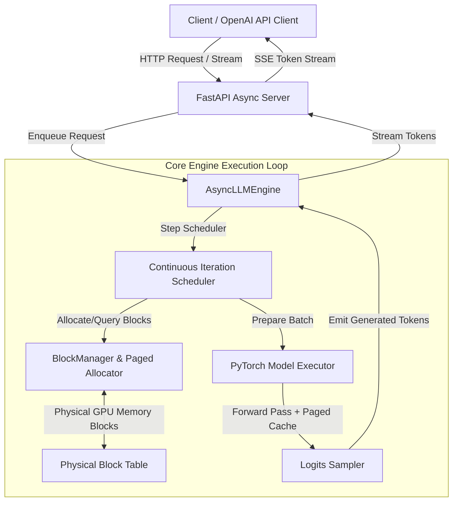

# ForgeServe 🚀

[](https://pypi.org/project/forgeserve/)
[](https://python.org)
[](https://opensource.org/licenses/MIT)
[](https://danishshaikh06.github.io/forgeserve/)

**ForgeServe** is a high-performance, modular Large Language Model (LLM) inference and serving engine built from scratch in PyTorch & Python. 

It implements modern inference optimization techniques—including **PagedAttention**, **Dynamic KV-Cache Block Allocation**, **Iteration-Level Continuous Batching**, and an **Async Serving Engine**—to maximize throughput and minimize latency during autoregressive token generation.

---

## ⚡ Key Architectural Features

* 🧠 **PagedAttention Memory Management**: Replaces contiguous KV cache pre-allocation with OS-style virtual memory block paging, eliminating memory fragmentation and reducing memory waste to near zero.
* 🔄 **Continuous Batching (In-Flight Batching)**: Iteration-level scheduling allows new requests to enter the batch instantly during decode steps without waiting for completed sequences to finish.
* ⚡ **Flash & Paged Attention Integration**: Dynamic KV cache indexing compatible with high-speed attention implementations.
* 🌐 **Async OpenAI-Compatible Server**: Async/Await streaming API supporting high-concurrency token generation via Server-Sent Events (SSE).
* 📊 **Comprehensive Benchmarking Suite**: Comparative benchmarks evaluating latency (TTFT, TPOT), throughput (tokens/sec), and memory delta across all engine phases.

---

## 🏗️ System Architecture



---

## 🗺️ Progressive Architecture Roadmap (Phases 1 – 5)

ForgeServe is engineered step-by-step to demonstrate the evolution of LLM inference performance:

| Phase | Core Mechanism | Key Breakthrough |
| :--- | :--- | :--- |
| **Phase 1** | **Naive Auto-Regressive Engine** | Baseline generation with repetitive forward passes over full prompt context. |
| **Phase 2** | **Key-Value (KV) Caching** | Caches past Keys & Values to avoid redundant attention compute. |
| **Phase 3** | **PagedAttention & Block Allocation** | Dynamic memory block paging eliminating contiguous pre-allocation waste. |
| **Phase 4** | **Continuous Batching & Scheduler** | Iteration-level sequence scheduling for maximum batch utilization. |
| **Phase 5** | **Async Serving Engine & API** | Multi-threaded async request processing with OpenAI API compatibility. |

---

## 🚀 Quickstart

### Installation

ForgeServe requires Python 3.10+ and PyTorch (with CUDA support recommended for performance).

Using [`uv`](https://github.com/astral-sh/uv):

```bash
# Clone the repository
git clone https://github.com/danishshaikh06/forgeserve.git
cd forgeserve

# Install in editable mode
uv tool install --editable .
```

Or using `pip`:

```bash
pip install -e .
```

---

## 💻 Usage

### 1. Launching the Serving API

Start the OpenAI-compatible HTTP inference server:

```bash
forgeserve serve --model Qwen/Qwen2.5-0.5B-Instruct --port 8000
```

### 2. Querying the Server (Python API / OpenAI Client)

```python
from openai import OpenAI

client = OpenAI(base_url="http://localhost:8000/v1", api_key="token-abc")

response = client.chat.completions.create(
    model="Qwen/Qwen2.5-0.5B-Instruct",
    messages=[{"role": "user", "content": "Explain PagedAttention in two sentences."}],
    stream=True
)

for chunk in response:
    if chunk.choices[0].delta.content:
        print(chunk.choices[0].delta.content, end="", flush=True)
```

---

## 📈 Benchmarks

ForgeServe includes built-in benchmarking tools to measure the performance delta between each architectural phase:

```bash
# Run memory fragmentation & throughput benchmark
python -m benchmarks.continuous_batching.benchmark_cb
```

Benchmark output categories available in `benchmarks/`:
* `benchmarks/naive`: Baseline performance without KV Caching.
* `benchmarks/kvcache`: Impact of basic Key-Value caching.
* `benchmarks/page_attention`: Memory savings with PagedAttention block allocation.
* `benchmarks/continuous_batching`: Throughput scaling under high request concurrency.
* `benchmarks/Memory_delta`: GPU VRAM consumption metrics across batch sizes.

---

## 📚 Complete Documentation Index

For in-depth explanations and architectural deep-dives:

### 💡 Core Concepts
* 📘 [Phase 1: Autoregressive Generation](docs/concepts/phase1/autoregressive_generation.md)
* 📘 [Phase 2: Key-Value Caching](docs/concepts/phase2/kv_cache.md)
* 📘 [Phase 3: PagedAttention & Dynamic Memory](docs/concepts/phase3/paged_attention.md)
* 📘 [Phase 4: Continuous Batching](docs/concepts/phase4/continuous_batching.md)
* 📘 [Phase 5: Async Engine & Streaming](docs/concepts/phase5/async_engine.md)

### 📐 Technical Architecture
* ⚙️ [Phase 1: Baseline Reference Engine](docs/architecture/phase1/phase1-reference-engine.md)
* ⚙️ [Phase 2: KV Cache Architecture](docs/architecture/phase2/kv_cache.md)
* ⚙️ [Phase 3: Block Manager & Allocator](docs/architecture/phase3/block_manager.md)
* ⚙️ [Phase 4: Iteration-Level Scheduler](docs/architecture/phase4/scheduler.md)
* ⚙️ [Phase 5: End-to-End Serving Pipeline](docs/architecture/phase5/serving_pipeline.md)

---

## 🧪 Development & Quality Assurance

Run tests and linting:

```bash
# Run test suite
uv run pytest

# Run QA checks (linting, formatting, type check)
just qa
```

---

## 📄 License & Author

Created with ❤️ by **[Danish Shaikh](https://github.com/danishshaikh06)**.

Distributed under the **MIT License**. See [`LICENSE`](LICENSE) for more information.
