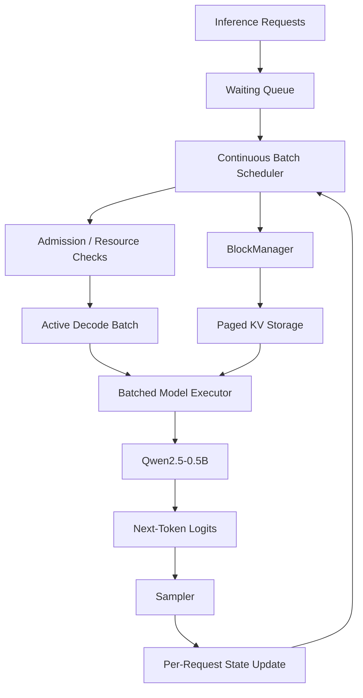

# ForgeServe

### Educational LLM Inference Engine for Understanding Modern GPU Inference

[](https://www.python.org/)
[](LICENSE)
[](https://danishshaikh06.github.io/forgeserve/)

ForgeServe is a small, modular **LLM inference engine built with Python, PyTorch, and Hugging Face Transformers**, designed to make modern inference systems understandable by implementing them step-by-step rather than treating inference as a black box.

The project progresses from a reference autoregressive implementation to:

**KV caching → optimized attention → paged KV storage → request scheduling → continuous batching → batched decode execution**

The goal is educational: build the mechanisms, understand the underlying systems, benchmark the trade-offs, and document what each optimization actually changes.

> **Scope:** ForgeServe is a learning-oriented inference engine, not a production replacement for systems such as vLLM. The repository intentionally favors implementation clarity, experimentation, and measurable results.

---

## Why ForgeServe?

A language model call may look as simple as:

```python
model.generate(...)
```

but efficient inference requires solving a much larger systems problem:

```text
Incoming Requests
        │
        ▼
Request Lifecycle
        │
        ▼
    Scheduler
        │
        ▼
Continuous Batching
        │
        ▼
 Batched Decode
        │
        ├───────────────┐
        ▼               ▼
    KV Storage      Attention
        │               │
        └───────┬───────┘
                ▼
               GPU
```

ForgeServe exposes these layers individually so that each optimization can be implemented, measured, and understood in isolation.

---

# Key Capabilities

### Inference Runtime

- Decoder-only autoregressive generation
- Explicit prefill/decode execution
- Hugging Face Transformers integration
- Modular runtime and generation engine
- Greedy decoding

### KV Cache

- Prefill-time Key/Value computation
- Cached decode path
- Elimination of repeated K/V computation
- Baseline comparison against naive full-sequence recomputation

### Attention Optimization

- Configurable attention backend
- EAGER baseline
- PyTorch SDPA execution
- Workload-level performance benchmarking

### Paged KV Storage

- Fixed-size KV block pool
- Per-request block ownership
- Dynamic block allocation
- Block reuse and reclamation
- Pool accounting and leak detection

### Continuous Batching

- Waiting and running request states
- FIFO admission
- Dynamic request completion
- Iteration-level batch membership changes
- KV-aware resource management

### Batched Decode

- One current token per active request
- Batched input construction: `(N, 1)`
- Single forward pass for active requests
- Per-request output mapping
- Dynamic batch composition as requests finish

---

# System Architecture



ForgeServe separates three major responsibilities:

```text
Scheduler
    → who runs and when

Runtime
    → how model execution happens

BlockManager
    → where request KV state is stored
```

---

# Inference Evolution

ForgeServe was developed as a sequence of progressively optimized inference implementations.

## Phase 1 — Reference Inference Engine

The initial engine establishes the baseline autoregressive generation loop:

```text
Prompt
  ↓
Tokenization
  ↓
Forward Pass
  ↓
Logits
  ↓
Sampling
  ↓
Next Token
  ↓
Repeat
```

This baseline provides the reference implementation for later optimizations.

---

## Phase 2 — KV Cache

Naive generation repeatedly processes the entire growing sequence.

ForgeServe introduces a prefill/decode split:

```text
Prompt
  ↓
Prefill
  ↓
Store K/V
  ↓
Decode one token
  ↓
Reuse cached K/V
  ↓
Decode next token
```

### Measured Results

Across four measured workloads:

```text
Total generation speedup : 1.04× – 1.15×
TPOT improvement         : ~5% – 17%
Peak allocation delta    : ~12–13 MB lower in tested runs
```

The peak-memory measurement represents total measured process GPU allocation and should not be interpreted as the isolated memory footprint of the KV cache.

---

## Phase 3 — Attention Optimization

ForgeServe adds PyTorch SDPA and benchmarks it against EAGER attention.

Measured TPOT speedups:

```text
Short workload    → 0.99×
Medium workload   → 1.10×
Long workload     → 1.03×
Long generation   → 1.10×
```

The strongest measured workload increased throughput from:

```text
27.4 tok/s → 30.2 tok/s
```

The benchmark is intentionally described as:

```text
EAGER vs SDPA
```

rather than as a definitive FlashAttention benchmark. Selecting the SDPA path does not independently prove that a specific FlashAttention kernel was selected for every measured operation.

---

## Phase 4 — Paged KV Storage

ForgeServe introduces a fixed-size block pool for request KV state.

Current benchmark configuration:

```text
512 KV blocks
16 tokens / block
96 MB KV pool
8,192 cached-token slots
```

A request maps its logical KV sequence to independently allocated blocks:

```text
Request A → [B7, B3, B1, B12]
Request B → [B5, B2]
```

The physical blocks do not need to be contiguous.

For a request containing `T` tokens:

\[
B =
\left\lceil
\frac{T}{\text{block size}}
\right\rceil
\]

Example:

```text
40 prompt tokens
128 generated tokens
-------------------
168 total tokens
```

With a block size of 16:

```text
168 / 16 → 11 blocks
```

The BlockManager provides:

- allocation
- ownership tracking
- reuse
- release
- free/used accounting
- leak detection

Core invariant:

\[
\boxed{
B_{used}+B_{free}=B_{total}
}
\]

> **Implementation scope:** ForgeServe currently implements paged KV-cache storage and block management. It does not claim a custom kernel-level PagedAttention implementation.

---

## Phase 5 — Continuous Batching

The scheduler maintains a dynamic set of active requests.

Instead of:

```text
Request A → finish
Request B → finish
Request C → finish
```

the active batch can evolve:

```text
[A, B, C, D]
[A, B, C, D]
[A, B,   D]
[A, B,   D, E]
...
```

Requests leave the running set when they finish, and waiting requests can enter when capacity becomes available.

The core lifecycle is:

```text
WAITING
   ↓
RUNNING
   ↓
FINISHED
```

The first scheduler uses:

```text
FIFO admission
+
dynamic request lifecycle
+
KV-aware resource management
```

---

## Phase 5B — Batched Forward Execution

The final decode optimization changes the model execution pattern.

### Before

Each active request performed a separate forward pass:

```text
forward(A)
forward(B)
forward(C)
forward(D)
```

### After

Active requests are combined into a single batched forward:

```text
forward([A, B, C, D])
```

At each decode step:

```text
batch_tokens.shape = (N, 1)
```

The resulting logits are mapped back to the corresponding request states.

This is the key transition from:

```text
N active requests
      ↓
N model forward calls
```

to:

```text
N active requests
      ↓
1 batched model forward call
```

---

# Performance

All primary benchmarks were performed on:

| Component | Configuration |
|---|---|
| Model | Qwen/Qwen2.5-0.5B-Instruct |
| GPU | NVIDIA RTX 4070 |
| Dtype | bfloat16 |
| Attention | PyTorch SDPA |
| Sampling | Greedy |
| Python | 3.11 |
| PyTorch | 2.8.0 |
| Transformers | 4.56.0 |
| KV blocks | 512 |
| Block size | 16 tokens |

> Results are measurements from the ForgeServe benchmark suite under the stated workloads. They are not universal performance guarantees.

---

## Continuous Batching — Uniform Workload

```text
Requests              : 4
Generated/request     : 80 tokens
Total generated       : 320 tokens
Average batch size    : 4.00
```

| Metric | Sequential | Batched |
|---|---:|---:|
| Wall time | 15,433 ms | **4,307 ms** |
| Token throughput | 20.7 tok/s | **74.3 tok/s** |
| Request throughput | 0.26 req/s | **0.93 req/s** |
| Mean latency | 3,858.2 ms | 4,305.3 ms |

### Result

**3.58× wall-time speedup**

**3.58× token-throughput gain**

**3.58× request-throughput gain**

The uniform workload is the clearest batching experiment because all four requests remain active for the complete 80-step decode.

---

## Throughput Scaling

| Concurrency | Sequential | Batched | Gain | Avg. Batch |
|---:|---:|---:|---:|---:|
| 1 | 22.2 tok/s | 19.9 tok/s | 0.90× | 1.00 |
| 2 | 24.4 tok/s | 27.9 tok/s | 1.14× | 1.47 |
| 4 | 21.3 tok/s | 40.9 tok/s | 1.92× | 1.82 |
| 8 | 21.8 tok/s | **67.6 tok/s** | **3.10×** | 3.63 |

At concurrency 8, ForgeServe reached:

```text
67.6 tok/s
```

with a measured:

```text
3.10× throughput gain
```

The average batch size is lower than submitted concurrency because requests can complete at different times.

---

## Queue Pressure

```text
Requests          : 12
Maximum batch size: 4
```

Measured:

```text
Sequential → 22.8 tok/s
Batched    → 60.2 tok/s
```

Results:

```text
2.64× token-throughput gain
2.75× wall-time speedup
```

Average batch size:

```text
3.31 requests / step
```

The workload also exposes the throughput/latency trade-off:

```text
Mean queue wait:
1,663.3 ms

Mean latency:
Sequential → 1,410.8 ms
Batched    → 3,290.2 ms
```

This demonstrates that higher system throughput does not automatically imply lower individual request latency.

---

# Key Engineering Lessons

ForgeServe was built around several core ideas.

### KV Cache

Previously computed Key/Value states can be reused instead of recomputed on every decode step.

### Paged KV Storage

Request KV state can be represented as independently managed fixed-size blocks rather than relying on one large contiguous allocation.

### Continuous Batching

Request membership can change from one decode step to the next.

### Batched Forward Execution

Multiple active requests can share one model forward pass.

### Resource Management

Compute capacity and KV-memory capacity are different constraints:

```text
Resident requests
        ≠
Forward batch size
```

### Benchmark-Driven Optimization

Every major optimization is compared against a simpler baseline:

```text
Naive Generation
      ↓
KV Cache

EAGER Attention
      ↓
SDPA

Sequential Requests
      ↓
Continuous Batching

Per-Request Forward
      ↓
Batched Forward
```

---

# Documentation

ForgeServe includes documentation at three levels.

### Architecture

Implementation-level explanations of:

```text
Reference Engine
Runtime
Generation Engine
Sampler
KV Cache
Attention Backends
Paged KV Storage
Continuous Batching
Batched Forward Execution
```

### Concepts

First-principles explanations covering:

```text
Autoregressive Generation
Logits
Greedy Decoding
KV Cache
Attention Masks
Padding
Position IDs
Cache Positions
Batched KV Cache
Continuous Batching
Scheduler Admission
Throughput vs Latency
Adaptive Batching
```

### Benchmarks

Each phase records:

```text
Configuration
Workload
Measurements
Interpretation
Limitations
```

The goal is to document not only **what improved**, but also **why it improved and what the benchmark actually proves**.

---

# Installation

ForgeServe currently targets **Python 3.11**.

## Clone

```bash
git clone https://github.com/danishshaikh06/ForgeServe.git
cd ForgeServe
```

## Install

Using `uv`:

```bash
uv sync
```

For development dependencies:

```bash
uv sync --all-groups
```

GPU inference and the benchmark suite are designed around CUDA-enabled PyTorch.

---

# Development

Run the test suite:

```bash
uv run pytest
```

Run linting:

```bash
uv run ruff check .
```

Check formatting:

```bash
uv run ruff format --check .
```

Run static type checking:

```bash
uv run mypy src
```

Benchmarks are located under:

```text
scripts/benchmarks/
```

---

# Project Structure

```text
forgeserve/
├── .github/
│   ├── ISSUE_TEMPLATE/
│   └── workflows/
│
├── docs/
│   ├── architecture/
│   ├── benchmark/
│   ├── concepts/
│   ├── api.md
│   ├── index.md
│   ├── installation.md
│   └── usage.md
│
├── scripts/
│   └── benchmarks/
│
├── src/
│   └── forgeserve/
│       ├── logger/
│       ├── scheduler/
│       └── ...
│
├── tests/
├── pyproject.toml
└── README.md
```

---

# Roadmap

The current educational inference stack covers:

```text
Reference Inference
        ↓
KV Cache
        ↓
Attention Optimization
        ↓
Paged KV Storage
        ↓
Request Scheduler
        ↓
Continuous Batching
        ↓
Batched Forward Execution
```

Potential areas for future contributors include:

- Reducing queue waiting time
- Adaptive batch-size selection
- Resource-aware admission
- Token/compute budget scheduling
- Scheduler fairness and aging
- GPU kernel profiling
- True kernel-level paged attention
- Async/concurrent serving
- OpenAI-compatible API
- Additional model and GPU benchmarks
- Further inference optimizations

The scheduler is intentionally extensible so contributors can experiment with alternative policies and measure their effects.

---

# Contributing

ForgeServe is designed to be approachable for engineers who want to learn LLM inference systems by modifying a relatively small codebase.

Useful areas for experimentation include:

```text
Scheduler Policies
Batch-size Selection
Queue Optimization
KV-cache Management
Attention Backends
GPU Profiling
Benchmark Methodology
Serving APIs
```

A useful workflow for inference improvements is:

```text
Baseline
   ↓
Implementation
   ↓
Benchmark
   ↓
Interpretation
   ↓
Documentation
```

Performance changes should include the workload and environment used for the measurement whenever possible.

---

# License

ForgeServe is released under the MIT License.

See [LICENSE](LICENSE) for details.

---

# Author

**Danish Shaikh**

[GitHub](https://github.com/danishshaikh06)
· [ForgeServe](https://github.com/danishshaikh06/ForgeServe)
