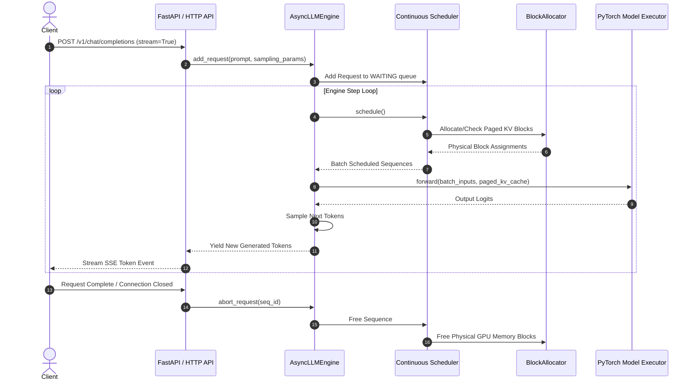

# Phase 5 Architecture: End-to-End Serving Pipeline

## Overview

This document details the complete request lifecycle and end-to-end component interaction within ForgeServe.

---

## Full System Sequence Diagram

---

## Component Interfaces & Responsibilities

### 1. `forgeserve.serving.api`
* Exposes standard HTTP endpoints compatible with standard OpenAI client libraries (`openai.OpenAI()`).
* Translates HTTP JSON payloads into internal `SamplingParams` and prompt sequences.

### 2. `forgeserve.engine.async_engine`
* Maintains request streams using `asyncio.Future` and `asyncio.Queue`.
* Drives the non-blocking engine iteration loop.

### 3. `forgeserve.scheduler.scheduler`
* Computes the batch layout for each forward pass.
* Manages `WAITING`, `RUNNING`, and `SWAPPED` sequence pools.

### 4. `forgeserve.page_attention.block_manager`
* Maps logical sequence blocks to physical GPU tensor buffers.
* Maintains memory block tables and reference counts.

### 5. `forgeserve.model.model_runner`
* Executes the PyTorch model forward pass using custom or PagedAttention kernels.
* Updates physical KV cache tensors in-place on CUDA memory.

---

## Performance Metrics & Telemetry

ForgeServe exports production runtime metrics:
* **TTFT (Time To First Token)**: Latency until the prefill step completes and the first token is emitted.
* **TPOT (Time Per Output Token)**: Average decode iteration step latency.
* **Throughput (Tokens/sec)**: Total tokens generated per second across all active concurrent sequences.
* **GPU Cache Utilization**: Percentage of allocated physical blocks in use vs. total block capacity.
